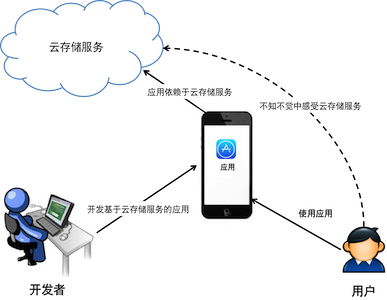

<a id="concepts"></a>
# 关键概念

<a id="user"></a>
## 开发者、客户、用户

本文档中会经常性的提到几个角色。

开发者是云存储服务的使用者，因此在文档中提到的客户等同于开发者。用户则是开发者所推出产品的直接使用者，也是云存储服务的间接使用者。



<a id="key-value"></a>
## 键值对（key-value）

键值对（key-value，简称kv）是一个常用的数据结构概念，通常又被称为字典（dictionary）或映射（map）。每个存放到该数据结构中的数据（value）都对应到一个全局唯一的键（key）。该数据结构的特征是以空间换时间，通过键查询值通常可以是一个比较快速的过程。

在存储系统中，键值对是和树形文件系统（file system，简称fs）对应的一个概念。一般人所了解的文件系统类型，比如Windows系统的FAT32和NTFS、Linux系统的EXT3等，都是树形文件系统的示例。树形文件系统的特征是以文件夹和文件的方式管理存储内容。

树形文件系统从早期比较符合常规的使用场景，让用户可以对大量内容进行有效的归类，比如桌面操作系统通常会缺省创建这些文件夹：图片、视频、文档、下载等。但树形文件系统的设计对于节点（即文件和文件夹）数量有一些限制，当节点数达到一个级数后，文件系统的性能将急剧下降到不可用的程度，因此操作系统一般会对文件夹中可包含的子节点数目设置一个上限。

在设计海量存储系统时，树形文件系统的两个缺陷就会凸显出来：性能限制、无法横向无限扩展。在这种考虑下，海量存储系统一般设计为键值对方式。键可以是一个任意字符串（有些设计中可能会保留一些字符），值就是一个具体文件。写入文件时，用户可以自行指定键（比如看起来接近于文件系统的格式：`/data/imgs/2011/1/1/img001.jpg`），或者让存储系统自动生成一个唯一的键并返回。使用者只需要知道使用入口（比如七牛的上传域名是`up.qiniu.com`），而无需了解文件具体会被存放到哪个机房的哪个设备，也无需知道存放的形式。要读取时用标准的HTTP GET方式访问对应的URL即可，如：

```
GET http://imgs.qiniu.com/data/imgs/2011/1/1/img001.jpg
```

<a id="resource"></a>
## 资源（resource）

资源（resource）是七牛云存储服务中的逻辑存储单元。对于每一个账号，该账号里存放的每一个资源都有唯一的标识。

资源的标识是一个字符串，在大部分情况下都接近于Linux文件路径的风格，比如：`level1/level2/example1.jpg`。但在七牛云存储中并没有路径的概念，因此这个标识并不表示是目录`level1/level2/`下的一个`example1.jpg`文件，而是这个资源的标识就是这样一个完整的字符串。因此，与Linux文件路径不同，资源的标识符可以包含任何字符，比如像冒号（:）这样不能在文件系统路径中出现的字符。

使用者可以在上传资源时为其指定一个方便管理的标识，比如通过设计好的前缀来达到类似于文件目录的分类和层次效果。比如对于一个网站的资源，我们可以命名如下的资源列表：

```
index.html
features/index.html
features/feature1.html
features/feature2.html
imgs/features/feature1.png
imgs/features/feature2.png
about.html
```

假设这些资源都位于某个绑定了域名`example.com`的公开空间中，则用户可以通过组合这样的URL访问这些资源：

```
http://www.example.com/features/index.html
``` 

或省略掉`index.html`，如下：

```
http://www.example.com/features
```

<a id="bucket"></a>
## 空间（bucket）

空间是资源的管理单位。资源必然位于某一个空间中。每个空间可以对应一系列的设置，以对资源提供合理的管理动作。

常见的设置有如下：

* 将空间设置为公开或私有，以控制空间内资源的访问权限；
* 设置资源的数据处理样式（style），以便于用简短的方式对资源进行处理；

<a id="fop"></a>
## 数据处理（fop）

数据处理（fop）是七牛云存储提供的一种强大的数据处理机制。开发者可以在上传或访问资源时触发数据处理流程，从而得到资源进行按需变换后的结果。

数据处理的执行非常简单，就是在资源请求中加上数据处理动作和参数，比如以下的URL对图片进行缩放，就是调用了一个名为`imageView`的数据处理操作：

```
http://qiniuphotos.qiniudn.com/gogopher.jpg?imageView/2/w/200/h/200
```

多个数据处理操作可以通过管道（pipe）进行连接，比如我们可以在一次请求中完成先对图片进行缩放，然后再在图片右下角添加一个透明图片水印。缩放和添加水印分别是一个数据处理操作。

<a id="style"></a>
## 数据处理样式（style）

如果觉得`url?<fop1>|<fop2>|<fop3>|<fopN>`这样的形式够冗长，还可以为这些串行的`<fop>`集合定义一个友好别名，之后可以用这个友好的别名来取代冗长的指令和参数。我们称这个别名为样式（style）。样式是对一个或一组数据处理操作的命名。

假如我们需要从目标视频中截取指定的一帧图片，并对该图片打上一个水印后最为该视频的封面图片，该数据处理的示例URL如下所示：

```
http://open.qiniu.com/thinkingingo.mp4?vframe/jpg/offset/7/w/480/h/360
|watermark/1/image/aHR0cDovL3d3dy5iMS5xaW5pdWRuLmNvbS9pbWFnZXMvbG9nby0yLnBuZw==
```

这个URL看起来非常长且难以理解目的。我们可以定义一个名为`coverpic`的样式，对应到相应的数据处理内容，则之后我们可以用如下使用方式：

```
http://open.qiniu.com/thinkingingo.mp4-coverpic
```

显然相比清晰很多也方便很多。