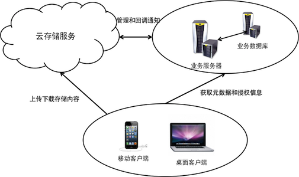
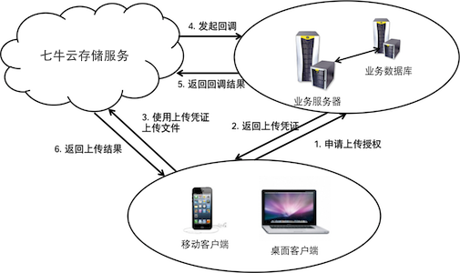

# 编程模型

以保护数据安全和考虑到架构合理性为出发点，我们对基于七牛云存储服务如何进行开发提供了一些设计和编码建议。希望开发者在使用七牛云存储服务之前详细阅读这些建议，并尽可能的符合这些原则，以免造成不必要的时间浪费和带来数据安全风险。

- [基本结构](#basic-structure)
- [业务流程](#workflow)
- [关键原则](#principle)

## 基本结构

基于七牛云存储服务构建的应用，建议使用如下基本架构：

从该结构图，我们可以看到以下这几个关键组件：

- 七牛云存储服务

	七牛云存储服务以[键值对](concepts.html#key-value)方式提供了非结构化资源存储服务。向**业务服务器**提供资源管理服务，向**客户端**提供资源上传和下载服务。

- 业务服务器

	开发者需要自行管理和维护的一组业务服务器，至少负责提供如下几个基本功能：
	
	- 生成各种安全凭证（参见[安全机制](security.html)），安全凭证的创建不能在客户端上进行，否则会产生极大的安全风险。
	- 使用关系型数据库（比如MySQL）管理用户帐号信息。最终用户信息的管理并非云存储服务的功能范畴。云存储服务只管理企业账号。
	- 使用数据库管理资源元数据和资源之间的映射关系。
	- 响应客户端的业务请求，执行业务流程并返回执行结果。
	
- 客户端

	客户端通常同时是资源的生产方和消费方。客户端在展示内容时，通常需要先从业务服务器获取资源的元信息，并得到必要的下载凭证，然后使用下载凭证从七牛云存储服务获取待展示的资源内容，从而实现一个完整的内容展示过程。

## 业务流程

关键的几个交互过程：

- 上传

	客户端在上传资源到云存储之前要先从业务服务器获取一个有效的上传凭证，因此需要先后和两个服务端打交道。
	
	
	
	如果有设置回调，则上传完成时七牛云存储会自动回调到指定的业务服务器。

	

- 下载

	公开资源因为不需要对应的下载凭证即可访问，客户端可以直接从云存储下载对应资源。私有资源因为需要对应的下载凭证，因此必须先和业务服务器打交道。
	
	按照实际的使用场景，客户端对于内容的展示非常类似于一个动态网页的生成过程，因此无论该页面内容是公开还是私有，均需要从业务服务器获取该展示页面的动态布局信息。所以通常显示过程也是需要先后和业务服务器及云存储服务打交道。

- 资源管理

	为了防止安全漏洞，资源管理动作只应在业务服务器端进行。如果允许客户端进行资源管理，即使将管理凭证的生成动作放到业务服务器端进行，仍然很容易被第三方截获请求全文，从而导致重放攻击的风险。

	
## 关键原则

这个模型的关键要点如下：

- 整个架构中需要一个业务服务器的组件。
- 无论如何，AccessKey/SecretKey均不得包含在客户端的分发包中，无论是二进制代码中、配置文件中，还是网页中。
- SecretKey不得在任何场景中的公网上传输，更不得传输到客户端。
- 业务服务器端应维持一个数据库，用于管理资源的元数据。
- 业务服务器端应维持一个最终用户的账号信息数据库，因为七牛并不负责管理最终用户信息。
- 原则上客户端和云存储的交互只应是上传和下载，不应使用任何其他的API。
