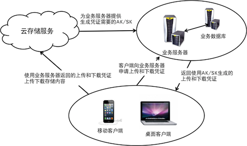

# 安全机制

数据安全性是云存储服务的重中之重。云存储的安全机制需要考虑主要以下几个因素：

1. 如何判断该请求方合法，且对目标空间有相应的访问权限？
1. 因为服务的访问协议同时支持HTTP和HTTPS，服务端需要判断收到的请求是否经过篡改。
1. 相比上传新资源，覆盖文件或删除已有资源拥有更高的风险。因此对上传或修改动作，需要确认请求方是否拥有修改或删除的权限。

在使用七牛云存储服务的过程中，需要考虑安全机制的场景主要有如下几种：

1. 上传资源；
1. 访问资源；
1. 管理和修改资源；

这三个场景需要考虑不同的安全因素，因此七牛针对性的提供了三种安全机制：上传凭证、下载凭证和管理凭证。

因为凭证的生成需要用到[SecretKey](#aksk)，因此该生成动作不应在不受信任的环境中进行。需要注意的是，开发者绝不能将密钥包含在分发给最终用户的程序中，无论是包含在配置文件中还是二进制文件中都会带来非常大的密钥泄漏风险。

推荐的模型如下所示：

## 密钥（AccessKey/SecretKey）

密钥用于以上几种凭证的生成。以SecretKey为参数，配合适当的签名算法，可以得到原始信息的数字签名，防止内容在传递过程中被伪造或篡改。

密钥通常为成对创建和使用，包含一个AccessKey和一个SecretKey。其中AccessKey会在传输中包含，而用户必须保管好SecretKey不在网络上传输以防止被窃取。若SecretKey被恶意第三方窃取，可能导致非常严重的数据泄漏风险。因此，如发现SecretKey被非法使用，管理员应第一时间在[管理平台](https://portal.qiniu.com)上更换密钥。

在具体描述各种凭证的详细生成过程中我们会看到AccessKey和SecretKey是如何被使用的。

## 上传凭证（UploadToken）

客户端上传前需要先获取从服务端颁发的上传凭证，并在上传资源时将上传凭证包含为请求内容的一部分。不带凭证或带非法凭证的请求将返回HTTP错误码401，代表认证失败。

生成上传凭证时需要指定以下要素：

1. 权限，指定上传的目标空间或允许覆盖的指定资源；
1. 凭证有效期。是一个符合[UNIX Epoch时间戳](http://en.wikipedia.org/wiki/Unix_Time)规范的数值，单位为**秒**；
	
	> 因为时间戳的创建和验证在不同的服务端进行（在业务服务器创建，在云存储服务器验证），因此开发者的业务服务器需要尽可能校准时间，否则可能出现凭证刚创建就过期等各种奇怪的问题。
	
1. 可选择设置的最终用户标识ID。这是为了让业务服务器在收到结果回调时能够识别产生该请求的最终用户信息；
1. 可选择设置的[结果返回方式](up/response/index.html)和[数据预处理指令](up/response/persistent-op.html)；

我们使用一个[上传策略（PutPolicy）结构](../reference/security/put-policy.html)来保存和传递这些设置。关于上传策略和上传凭证的生成细节，请查看[上传凭证规格](../reference/security/upload-token.html)。关于上传凭证的具体使用方法，请参见[资源上传](up/index.html)。

## 下载凭证（DownloadToken）

下载私有资源的请求需要带一个合法的下载凭证。不带凭证或带非法凭证的请求将返回HTTP错误码401，代表认证失败。

与上传凭证相比，下载凭证的作用比较简单：

1. 保证请求发起者拥有对目标空间的访问权限；
1. 保证服务端收到的下载请求内容未经中途篡改，具体包括目标资源的URI和该访问请求的有效期信息均应未受到篡改；

关于下载凭证的生成细节，请查看[下载凭证规格](../reference/security/download-token.html)。关于下载凭证的具体使用方法，请参见[私有资源下载](dn/security.html#download-private-resource)。

## 防盗链

下载还有一种常见的场景，即公开资源的防盗链，比如禁止特定来源域名的访问，禁止非浏览器发起的访问等。

我们可以通过HTTP协议支持的Referer机制（参见[HTTP Referer](http://en.wikipedia.org/wiki/Referrer)）来进行相应的来源识别和管理。

防盗链是一个系统设置，不影响开发工作。如发现有盗链情况，开发者可在[开发者平台](https://portal.qiniu.com/)的空间设置页面进行相应的设置。

## 管理凭证（AccessToken）

在管理现有资源时（如查看资源元数据、删除或移动资源等）通常需要带一个合法的管理凭证。不带凭证或带非法凭证的管理请求将返回HTTP错误码401，代表认证失败。

管理凭证的作用与下载凭证比较类似：

1. 保证请求发起者拥有对目标空间的管理权限；
1. 保证服务端收到的管理请求内容未经中途篡改，具体包括代表管理动作的URI和该管理动作的参数信息均应未受到篡改；

关于管理凭证的生成细节，请查看[管理凭证规格](../reference/security/access-token.html)。关于管理凭证的具体使用方法，请参见[资源管理](rs/security.html)。

## 跨域访问

出于安全的考虑，Web 浏览器从很早之前就定下“同域安全策略”的标准，默认情况下同一域名下的页面只能向同域（包括 CNAME 域名、端口）下的 URL 发送所有类型的 HTTP 请求。而向不同域的地址发送非 GET 请求时，默认情况下只能返回同域安全策略错误。

对此，在发起上传或下载请求的时候，七牛的服务会返回相应的支持跨域的 Header:

### 上传(`up.qiniu.com`)

	Access-Control-Allow-Headers: X-File-Name, X-File-Type, X-File-Size
	Access-Control-Allow-Methods: OPTIONS, HEAD, POST
	Access-Control-Allow-Origin: *

### 下载(`<bucket>.qiniudn.com`)

	Access-Control-Allow-Origin: *
