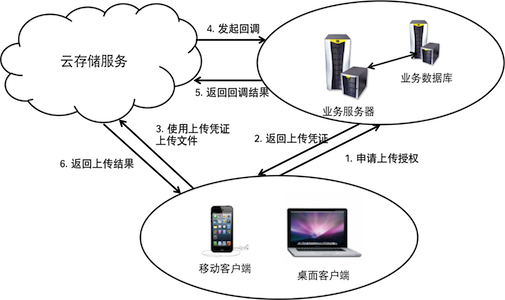

<a id="callback"></a>
# 回调（callback）

开发者可以要求七牛云存储在某文件上传完成后向特定的URL发起一个回调请求。七牛云存储会将该回调的响应内容作为文件上传响应的一部分一并返回给客户端。回调的流程如下图所示：



要启用回调功能，业务服务器在签发上传凭证时需要设置[上传策略](../../../reference/security/put-policy.html)中的`callbackUrl`字段,并且设置`callbackBody`字段。

<a id="callback-url"></a>
## 回调地址

通过设定上传策略中的`callbackUrl`字段为一个有效的地址，即可让七牛云存储在文件上传完成后向该地址发起回调请求。

该地址可以是一个HTTP或者HTTPS的URL，允许公网访问。

如果需要传递自定义的请求内容，开发者可以考虑配合使用上传策略中的`callbackBody`字段。如果只有`callbackUrl`而没有`callbackBody`，回调服务器收到的请求内容将为空。

<a id="callback-body"></a>
## 回调内容

同普通客户端直传和重定向上传一样，用户也可以控制回调中传递到客户回调服务器的反馈信息。`callbackBody`的格式如下：

```
<item>=(<magicvar>|<xvar>)[&<item>=(<magicvar>|<xvar>)...]
```

一个典型的`callbackBody`设置如下：

```
put_policy = '{
    ...
    "callbackBody" : "name=$(fname)&hash=$(etag)&location=$(x:location)\
	                  &price=$(x:price)&uid=123"
    ...
}'
```

上面的 `callbackBody` 示例中，混合使用了魔法变量（name,hash）、自定义变量(location,price)及自定义常量(uid)。
假设应用客户端发出了如下的上传请求：

```
<form method="post" action="http://up.qiniu.com/" enctype="multipart/form-data">
    <input name="key" type="hidden" value="sunflower.jpg">
    <input name="x:location" value="Shanghai">
    <input name="x:price" value="1500.00">
    <input name="token" type="hidden" value="...">
    <input name="file" type="file" />
</form>
```

其中，客户端发送了自定义变量的值`x:location = Shanghai`和`x:price = 1500.00`，七牛云存储将根据上传资源的实际情况填写魔法变量`$(fname)`和`$(etag)`的值。

完成上传后，七牛云存储便会构造出如下的回调信息：

```
name=sunflower.jpg&hash=Fn6qeQi4VDLQ347NiRm- \
RlQx_4O2&location=Shanghai&price=1500.00&uid=123
```

七牛云存储将这组数据作为请求Body发送至用户指定的回调服务器,请求方式为POST。回调服务器将接收到以下格式的请求内容：


```
POST /callback  HTTP/1.1
Content-Type: application/x-www-form-urlencoded
User-Agent: qiniu go-sdk v6.0.0
Host: api.examples.com
Authorization: QBox iN7NgwM31j4-BZacMjPrOQBs34UG1maYCAQmhdCV:tDK-3f5xF3SJYEAwsll5g=

name=sunflower.jpg&hash=Fn6qeQi4VDLQ347NiRm- \
RlQx_4O2&location=Shanghai&price=1500.00&uid=123
```

回调服务器接收到回调请求后，负责生成七牛返回给客户端的数据(json格式)，该数据作为此次回调请求的响应内容。如果回调成功，回调服务应对七牛云存储作出类似如下的响应（注意：回调响应内容由回调服务生成，以下仅作为示例）：

```
HTTP/1.1 200 OK
Server: nginx/1.1.19
Date: Thu, 19 Dec 2013 06:27:30 GMT
Content-Type: text/html
Transfer-Encoding: chunked
Connection: keep-alive
Cache-Control: no-store, no-cache, must-revalidate, post-check=0, pre-check=0
Pragma: no-cache


{"success":true,"name":"sunflowerb.jpg"}
```

七牛云存储将上面的回调结果返回给客户端，客户端接收到以下回应：

```
HTTP/1.1 200 OK
Content-Type: application/json
Cache-Control: no-store
Server: nginx/1.4.4
Date: Thu, 19 Dec 2013 08:04:56 GMT
Pragma: no-cache
X-Log: BDT:4;BDT:2;LBD:13;rs.put:1048;rs-upload.putFile:2514;UP.CB:3088;UP:5603
X-Reqid: iDYAAPBicOGXLUET

{"success":true,"name":"sunflowerb.jpg"}
```

如果回调失败，七牛云存储会将返回给应用客户端[HTTP状态码579](../../../reference/codes.html)以及详细的失败信息。

<a id="callback-security"></a>
## 安全性

由于回调地址是公网可任意访问的，回调服务如何确认一次回调是合法的呢?

七牛云存储在回调时会对请求数据加密，并将结果包含在请求头Authorization字段中，示例如下：

```
 Authorization:QBox iN7NgwM31j4-BZacMjPrOQBs34UG1maYCAQmhdCV:tDK-3f5xF3SJYEAwsll5g=
```

其中`QBox `为固定值，`iN7Ngw...dCV`为用户的Accesskey,`tDK-3f...5g=`为加密结果(encoded_data)

回调服务器可以通过以下方法验证其合法性：

- 获取AUTHORIZATION字段值中的加密结果部分encoded_data

- 根据Accesskey选取正确的SecretKey

- 获取明文：data = Request.URL.PATH +"\n" +Request.Body

- 采用HMAC-SHA1加密算法，对明文data加密，秘钥为SecretKey,比较加密结果是否与Authorization中的encoded_data字段相同,如果相同，表明这是一个合法的回调请求。

以PHP语言为示例，验证代码如下：

``` php
/**
*C('accessKey')取得 AccessKey
*C('secretKey')取得 SecretKey
*callback.php 为回调地址
*file_get_contents('php://input')获取RequestBody,其值形如:
*name=sunflower.jpg&hash=Fn6qeQi4VDLQ347NiRm-RlQx_4O2\
*&location=Shanghai&price=1500.00&uid=123
*/
function IsQiniuCallback(){
	$authstr = $_SERVER['HTTP_AUTHORIZATION'];
	if(strpos($authstr,"QBox ")!=0){
		return false;
	}
	$auth = explode(":",$substr($authstr,5));
	if(sizeof($auth)!=2||$auth[0]!=C('accessKey')){
		return false;
	}
	$data = "/callback.php\n".file_get_contents('php://input');
	return URLSafeBase64Encode(hash_hmac('sha1',$data,C("secretKey"), true)) == $auth[1];
}
```
注意：如果回调数据包含用户的敏感数据，建议回调地址使用HTTPS协议
