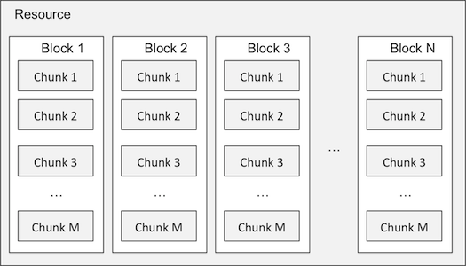
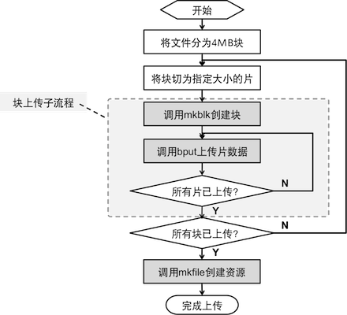

<a id="upload-types"></a>
# 上传类型

- [表单上传](#form-upload)
  - [使用方法](#form-upload-usage)
  - [后续动作](#form-upload-response)
- [分片上传](#chunked-upload)
    - [关键概念](#chunked-upload-concepts) 
    - [基本流程](#chunked-upload-workflow)
    - [并发上传](#parallel-upload)	
    - [断点续传](#resumable-upload)	
    - [上传后续动作](#chunked-upload-response)	
    - [在线示例](#online-demo)

开发者可以选择以下两种上传类型来完成一个文件的上传过程。

- 表单上传

	该类型在一个单一的HTTP POST请求中完成一个文件的上传，比较适合简单的应用场景和尺寸较小的文件。
	
	关于表单上传的使用细节，请参见[表单上传](/docs/v6/api/overview/up/upload-models/upload-types.html#form-upload)。
	
- 分片上传

	顾名思义，分片上传是将一个文件分为多个尺寸相同的小数据块，每个小数据块以一个独立的HTTP请求分别上传。所有小数据块都上传完成后，再发送一个请求给服务端将这些小数据块组织成一个逻辑资源，以完成这个上传过程。
	
	相比表单上传而言，分片上传机制可以提供以下几个明显的好处：
	
	- 适合尺寸较大的文件传输，通过分片来避免单个HTTP数据量过大而导致连接超时的现象。
	- 在网络条件较差的环境下，较小尺寸的文件可以有较高的上传成功率，从而避免无休止的失败重试。
	- 超过4MB大小的文件可以划分为多个4MB大小的数据块并发上传。
	- 支持断点续传。
	
	相比表单上传，分片上传需要多次HTTP请求才能完成上传过程，因此必然会有额外的成本开销。另外代码的复杂度也会有明显增加，因此选择是否使用分片上传时应谨慎评估使用该方法的必要性。
	
	分片上传的相关细节请参见[分片上传](/docs/v6/api/overview/up/upload-models/upload-types.html#chunked-upload)。
	


	
<a id="form-upload"></a>
## 表单上传


表单上传类型适用于文件内容可以在一次HTTP请求即可传递完成的场景。该功能非常适合于在浏览器中使用HTML表单上传资源，或者在不需要处理复杂情况的客户端开发中使用。

开发者只要组装一个符合**HTML文件上传表单**规范（参见[RFC1867](http://www.ietf.org/rfc/rfc1867.txt)）的HTTP请求，并以POST方式向域名`upload.qiniu.com`发起这个请求，即可将指定文件上传到服务端。业务逻辑非常简单明了。

<a id="form-upload-usage"></a>
### 使用方法

我们可以用如下的HTML表单来描述表单上传的基本用法：

```
<form method="post" action="http://upload.qiniu.com/"
 enctype="multipart/form-data">
  <input name="key" type="hidden" value="<resource_key>">
  <input name="x:<custom_name>" type="hidden" value="<custom_value>">
  <input name="token" type="hidden" value="<upload_token>">
  <input name="file" type="file" />
  <input name="crc32" type="hidden" />
  <input name="accept" type="hidden" />
</form>
```

HTML表单上传的几个关键参数说明如下：

名称        | 类型   | 必填 | 说明
------------|--------|------|-------------------------------------
token       | string | 是   | 必须是一个符合相应规格的[上传凭证](/docs/v6/api/reference/security/upload-token.html)，否则会返回401表示权限认证失败。
file        | file   | 是   | 文件本身。
key         | string | 否   | 资源名，必须为UTF-8编码。**Note:** 如果在生成上传凭证的[上传策略](/docs/v6/api/reference/security/put-policy.html) 中 `scope`指定为：`<bucket>:<key>`, 则该字段也必须指定。
x:\<custom_field_name\> | string | 否 | [自定义变量](/docs/v6/api/overview/up/response/vars.html#xvar)，必须以 `x:` 开头命名，不限个数。里面的内容将在 `callbackBody` 参数中的 `$(x:custom_field_name)` 求值时使用。
crc32       | string | 否   | 上传内容的crc32 校验码。<br>如填入，则七牛服务器会使用此值进行内容检验。
accept      | string | 否   | 当 HTTP 请求指定 `accept` 头部时，七牛会返回 `content-type` 头部的值。<br>该值用于兼容低版本 IE 浏览器行为。低版本 IE 浏览器在表单上传时返回 `application/json` 的时候会表现为下载，返回 `text/plain` 才会显示返回内容。

上传过程在一个HTTP请求和响应中完成，因此该过程将阻塞直到文件传输成功完成或失败为止。如果文件较大，或者网络环境较差，可能会导致HTTP连接超时而上传失败。若发生这种情况，开发者需要考虑换用更安全但也相对复杂的[分片上传](/docs/v6/api/overview/up/upload-models/upload-types.html)功能。

提交以上这个HTML表单而生成的HTTP请求内容大致如下所示：

```
POST http://upload.qiniu.com/
Content-Type: multipart/form-data; boundary=<Boundary>
--<Boundary>

Content-Disposition: form-data; name="key"
<resource_key>
--<Boundary>

Content-Disposition: form-data; name="x:<custom_field_name>"
<custom_value>
--<Boundary>

Content-Disposition: form-data; name="token"
<upload_token>
--<Boundary>

Content-Disposition: form-data; name="file"; filename="[文件名]"
Content-Type: <MimeType>
[文件内容]
--<Boundary>--
```

在非网页开发的场景中，开发者完全可以自行组装这个HTML表单请求。考虑到各个平台上的网络库都已经对HTML文件上传表单有非常完整的支持，组装这个请求的过程将会非常轻松。

<a id="form-upload-response"></a>
### 后续动作

我们可以在生成上传凭证时指定一系列的参数，以控制服务器在文件上传完成后的后续动作。我们将在[上传后续动作](/docs/v6/api/overview/up/response/)中详细描述各种参数的用法和作用。

另外如果需要，我们可以在表单参数中增加一系列的[魔法变量](/docs/v6/api/overview/up/response/vars.html#magicvar)和[自定义变量](/docs/v6/api/overview/up/response/vars.html#xvar)。上述表单例子中的`<x:custom_field_name>`就是变量的使用方法示意。我们可以将其更换为一系列魔法变量或自定义变量。

变量将会在回调和自定义返回内容中起到极大的作用。具体用法请参见[回调通知（callback）](/docs/v6/api/overview/up/upload-models/response-types.html)和[自定义返回内容（ReturnBody）](/docs/v6/api/overview/up/response/response-body.html)对应的使用方法描述。

<a id="chunked-upload"></a>
## 分片上传


分片上传功能支持将一个文件切割为一系列特定大小的小数据片，分别将这些小数据片分别上传到服务端，全部上传完后再在服务端将这些小数据片合并成为一个资源。[上传模型][uploadModelHref]中对分片上传的特点进行了完整的阐述。

<a id="chunked-upload-concepts"></a>
### 关键概念

分片上传引入了两个概念：**块**（block）和**片**（chunk）。每个**块**由一到多个**片**组成，而一个资源则由一到多个**块**组成。他们之间的关系可以用下图表述：



**块**是服务端的永久数据存储单位，**片**则只在分片上传过程中作为临时存储的单位。服务端会以约一个月为单位周期性的清除上传后未被合并为块的数据片。

<a id="chunked-upload-workflow"></a>
### 基本流程

与分片上传相关的API有这几个：[创建块（mkblk）][mkblkHref]、[上传片（bput）][bputHref]、[创建资源（mkfile）][mkfileHref]。一个完整的分片上传流程可用下图表示：



其中的关键要点如下：

1. 将待上传的文件按预定义的4MB块大小切分为若干个块。如果这个文件小于4MB，当然也就只有一个块；  
2. 将每个块再按预定义的片大小切分为若干个片，先在服务端创建一个相应块（通过调用[mkblk][mkblkHref]，并带上第一个片的内容），然后再循环将所有剩下的片全部上传（通过调用[bput][bputHref],从而完成一个块的上传）；  
3. 在所有块上传完成后，通过调用[mkfile][mkfileHref]将这些上传完成的块信息再严格的按顺序组装出一个逻辑资源的元信息，从而完成整个资源的分片上传过程。  

如要更准确的理解这个基本流程，可以通过阅读SDK源代码。所有SDK的源代码都公开托管在[Github](http://github.com/qiniu)上。

<a id="parallel-upload"></a>
### 并发上传

由于之前介绍的片上传过程中的Context机制，每个块内部只能按顺序逐一上传该块所切分好的片。而每个块之间相互独立，因此若干个块可以同时进行传输而不会相互干扰，因此我们可以利用这个特征实现并发上传特性。

每个文件对应的最大理论并发上传数量也即该文件可划分的块数量。当然这个理论数量也受到很多其他因素的制约，比如像iOS限定了每个APP最多只能开4个并发HTTP连接，也即在iOS上，无论有多少个块，最大的并发上传数量不可能超过4个。并不是并发数量越大上传速度就会越快。因此在实际开发中，通常会使用线程池（Thread Pool）技术来控制并发数量。

<a id="resumable-upload"></a>
### 断点续传

虽然片的存在周期并非永久，但已足以实现断点续传机制。

每成功上传一个片，客户端都会收到服务端返回一个代表当前已上传多少片的进度信息，我们称之为Context。上传下一个片时应提供前一个片上传成功后返回的Context。因此，这个Context可以认为是片传输进度的一个标记。

如果上传过程中，服务端发现一个块已经被片数据装满，那么最后一个片上传成功后返回的Context将是一个特殊的值`EOB`，告诉客户端不要再往这个块附加更多的片。

如果客户端在每次收到Context信息时都将其持久化到本地，即使客户端程序意外崩溃或正常重启，都可以在启动时读取上一次上传成功的片对应的Context，从而接着继续传输剩余片。这个效果我们称之为断点续传。

断点续传功能在上传一个需要较长时间比如一天时间才能上传完毕的大文件时尤其有价值，毕竟我们很难保证这段很长的时间内客户端都不会被关闭，且网络也一直处于连接状态。当前主流的移动平台（iOS、Android、Windows Phone 8）都有监测非活动应用并自动将其关闭的功能，这意味着在移动平台上我们要上传一个大文件时更容易遇到中途程序突然被关闭的情况，断点续传也就更有价值。

支持断点续传功能之后，在客户端很自然可以支持一个新功能：暂停或恢复某个文传的上传过程。

<a id="chunked-upload-response"></a>
### 上传后续动作

我们曾在[上传模型][uploadModelHref]中提过，在上传时开发者可以指定上传完成后服务端的后续动作，比如回调通知（callback）、自定义返回内容、303重定向等。可设置的后续动作与[表单上传][formUploadHref]中完全一致。

这里需要明确的是，虽然后续动作在生成[上传凭证][uploadTokenHref]时已经指定，但这些后续动作只在服务端处理完mkfile请求后才会发生，而且也只有mkfile请求的内容可以包含[变量][varsHref]。

[uploadModelHref]:	/docs/v6/api/overview/up/upload-models/ "上传模型"
[formUploadHref]:	/docs/v6/api/overview/up/upload-models/upload-types.html#form-upload 
[mkblkHref]:		/docs/v6/api/reference/up/mkblk.html "创建块"
[bputHref]:			/docs/v6/api/reference/up/bput.html "上传片"
[mkfileHref]:		/docs/v6/api/reference/up/mkfile.html "创建资源"
[uploadTokenHref]:	/docs/v6/api/reference/security/upload-token.html "上传凭证"
[varsHref]:			/docs/v6/api/overview/up/response/vars.html "变量"


<a id="online-demo"></a>
### 在线示例

[在线断点继上传示例](http://jsfiddle.net/gh/get/extjs/4.2/icattlecoder/jsfiddle/tree/master/resumbleupload)
