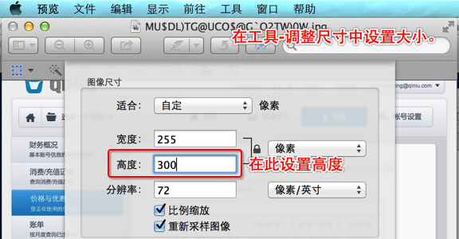
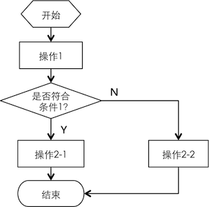
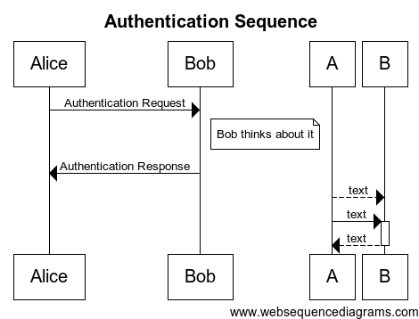

# 绘图规范与工具

这里的绘图规范和工具专门针对参考性的技术文档。这些文档的共性在于文档的表达准确性要远重要于文档本身的美感。

在编写其他类型的文档比如市场和销售文档时，也可以参考这些规范，但不强求完全遵循。

## 绘图规范

所有参考文档中的各类图形需要以统一的方式展现，基本原则如下：

1. 尽可能只用黑色线框表达；

	用不同的颜色标识区别会导致在非彩色介质上的阅读困难（如灰度打印，电子墨水屏等）。而且即使在彩色屏幕上，也可能因为屏幕故障而导致不确定的识别困难。
	
	如果确定使用不同颜色是最佳的表达方式，也应考虑该彩色示意图在黑白状态下的可读性。

1. 图形不应使用任何视觉特效，如阴影、立体、渐变等；

	这些特效可能会让绘图在屏幕上显得比较美观，但无助于读者对于绘图的理解。这样就偏离了文档本身的关键目标。因为打印质量的不确定，这些效果可能会导致打印后的效果不清晰。

1. 不同作用的线条应使用线型区分；

	使用不同颜色和粗细的线条对于很多人而言有很大的识别困难。相比之下，实线、虚线、点划线就有非常明确的区分度。写作者可以考虑组合使用颜色、粗细和线型来区分不同作用的线条，但我们强烈建议不管如何都优先用线型来区分。

1. 填充颜色不应成为区分两个矩形的唯一手段；

	我们偶尔会需要使用带填充色的矩形来标识不同的功能或子系统。但我们需要明确，不要只用颜色来区分两者，所有需要区分的区域都应带上相应的描述文字。
	
1. 控制图片的尺寸

	应尽可能不要让图片的高度大于400px。可能的话，请一直使用300px的高度。各个操作系统上都有缺省提供的图片缩放的工具，比如Mac OS X上的预览程序中就可以直接设置图片的缩放尺寸。

1. 应保留绘图文件，将其等同于源文件的地位；

	原则上应和markdown文档放在同一位置且使用同一名称，避免不可维护；比如描述上传模型的markdown文件名为`upload-model.markdown`，那么对应的绘图文件应命名为`upload-model.pptx`（假设使用PowerPoint作为绘图工具）。

## 示例

### 图标

图标是指绘图中代表特定目标的单位图形，比如一台电脑、一个用户等。根据场景，写作者可以选择使用以下两种风格的图例（分别对应iOS7和iOS6）：

1. 拟物图标

	这类图例效果可用彩色照片作为类比。立体且有丰富的颜色表达。虽然不一定要完全拟物（比如进行一些适当的夸张），但整体而言要给人立体的生动感。示例如下：

	

1. 平面单色图例

	这种图例效果可使用象形文字作为类比。平面，单色，甚至一般情况下线条的粗细看起来都是一致的。

	

### 部署结构图

部署结构图分两种，一种是以矩形表达的部署层次，另一种是以图标表达的子系统间交互关系描述。

子系统间的交互关系：

> TODO: 部署关系。

部署层次可使用脑图或者尽可能简单的块结构：

> TODO: 子系统层次。

### 流程图

流程图采用最基本的流程图例，尽可能不使用偏复杂的图例，比如预定义流程等，尽可能只使用以下示例中的元素：

### UML图

由于UML图本身的阅读也需要一个学习过程，我们并不建议在文档中使用各种UML图，除非在一些非常正式的文档中，比如面向大型客户提交的方案文档。

在常规的情况下，可以考虑使用的是UML中的时序图（Sequence Diagram），以精确表达一个功能背后多个子系统之间的协作关系。使用时序图时也应遵循基本原则，尽可能不用各种复杂的效果。

以下是建议的时序图风格示例：

### UI原型图

这类图很少会用到，在参考性文档中最有可能使用的是对于方案文档中的示例界面描述。

如果需要绘制原型图，Web原型图应要么使用线框图（Wireframe）,要么使用Bootstrap风格。其他端（比如iOS设备）应要么使用线框图，要么使用该平台的原生UI样式。

## 工具选择

工具选择应考虑成本和使用门槛。避免一个人写的文档不再可以维护。

### 兼容PPT格式的演示软件

比如Microsoft PowerPoint、OpenOffice/LibreOffice、WPS、Apple Keynote等。使用PPT中最简单的图形类型其实已经可以很好的表达绝大多数的场景。

常规建议使用的图形类型：矩形、圆角矩形、椭圆、标注。线条类型使用实线、虚线、点划线。

比较适合绘制的示意图类型为：层级结构图、子系统关系图、流程图等。

注意请一直将文档保存为.pptx/.ppt格式，避免出现因兼容问题而在另一个软件无法打开的情况。

在PPT中快速绘制UI原型图：<http://keynotopia.com/keynote-mockups-templates/>

### OmniGraffle

该软件的特点在于内置了比较强大的模板库。非常容易的可以绘制常见的插图。

产品官网：<http://www.omnigroup.com>。

### ArgoUML

该工具用于绘制UML图。

比较适合绘制的示意图类型为：时序图、类图、用例图等各种UML图形。

产品官网：<http://argouml.tigris.org/>。

在线UML：<https://www.websequencediagrams.com>。

### Axure RP Pro

该软件用于绘制界面原型图，且可以制作基本够用的交互效果。

产品官网：<http://www.axure.com>。

### XMind

这是一个免费的脑图软件（Mind Map），可以用于表达非常多的场景，但一般情况下脑图只用于整理思路和沟通的目的而非正式文档。写作者可以活学活用。

产品官网：<http://www.xmind.net>。

### Graphviz

用脚本的方式编写图形。适合于一些比较极端的场景，比如经常需要使用diff两个图形的时候。

产品官网：<http://graphviz.org/>。
