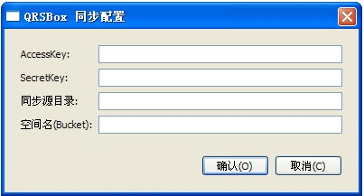
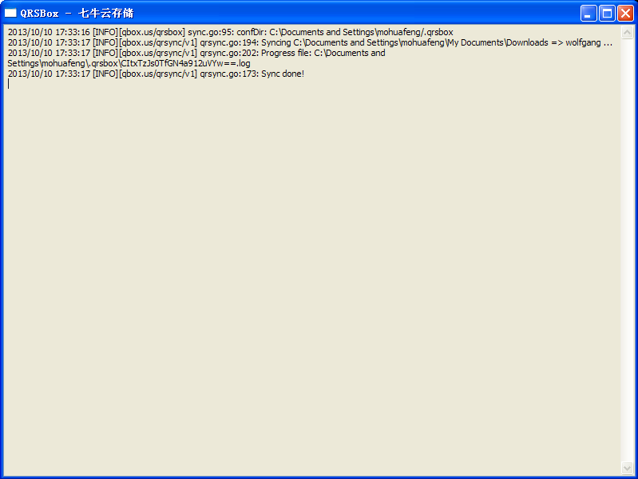

- [简介](#intro)
- [下载](#download)
- [使用方法](#usage)
    - [Windows GUI 的使用](#usage-gui)
    - [命令行使用方法](#usage-cmd)

<a id="intro"></a>

## 简介

QRSBox是七牛云存储提供同步上传的客户端工具，可以用于Linux、OSX、Windows等操作系统。
QRSBox可将用户本地的某个目录的文件同步到七牛云存储中，支持大文件上传，支持增量同步。此外，它还能够监控目录变化，将目录中新增的文件上传至七牛云存储。
需要注意的是，QRSBox不会同步文件的删除操作。也就是，如果被监控的目录中文件被删除，已上传至七牛云存储的文件将仍旧保留。如果用户确实需要删除该文件，可以到七牛的 [开发者平台](https://portal.qiniu.com/) 中删除。采用这种方式的目的是为了防止用户误删文件造成数据丢失。同时，另外的一个好处是，就是同步完一个文件后，本地就可以直接删除它以释放本地的磁盘空间。

关于QRSBox的一些疑问，可以在[疑问简答](http://kb.qiniu.com/537ps105)中找到答案。

<a id="download"></a>

## 下载

QRSBox下载地址：

- Windows GUI: [qrsbox windows_386](http://devtools.qiniudn.com/qiniu-devtools-windows_386-current.zip)

- 命令行工具：
    - Mac OS X: [qrsboxcli darwin_amd64](http://devtools.qiniudn.com/mac/qrsboxcli)
    - Linux 64bits: [qrsboxcli linux_amd64](http://devtools.qiniudn.com/qiniu-devtools-linux_amd64-current.zip)
    - Linux 32bits: [qrsboxcli linux_386](http://devtools.qiniudn.com/qiniu-devtools-linux_386-current.zip)

<a id="usage"></a>

## QRSBox使用方法

QRSBox包含 Windows GUI 和 命令行工具两部分。前者可在 Windows中使用，由于拥有GUI界面，使用更加方便。后者适合 Linux/OS X 等类 Unix 操作系统使用。当然，命令行工具也有 Windows 版，可在 Windows 的命令行使用。

<a id="usage-gui"></a>

### Windows GUI 的使用

首先，下载 QRSBox 的 Windows GUI，并解压。

然后，在资源管理器中，进入解压后的文件，双击qrsbox.exe，弹出如下图所求的界面：

<div class="imgwrap"></div>

其中，`access_key` 和 `secret_key` 在七牛云存储平台上申请。步骤如下：

1. [开通七牛开发者帐号](https://portal.qiniu.com/signup)
1. [登录七牛开发者自助平台，查看 Access Key 和 Secret Key](https://portal.qiniu.com/setting/key)

`同步源目录` 是本地需要上传的目录，绝对路径完整表示。这个目录中的所有内容会被同步到指定的 `bucket` 上。注意：Windows 平台上路径的表示格式为：`盘符:/目录`，比如 E 盘下的目录 data 表示为：`e:/data` 。

`空间名(bucket)` 是你在七牛云存储上希望保存数据的 Bucket 名（类似于数据库的表），这个自己选择一个合适的就可以，要求是只能由字母、数字、下划线等组成。

完成这些设置后，点击确认，QRSBox 便会开始进行初始化。初始化完成后，就开始文件的同步。用户可以在qrsbox的界面上看到同步的进程，大致如下图所示：



随着文件同步的进行，用户可以在[开发者平台](https://portal.qiniu.com/)的空间管理中看到已上传的文件。

QRSBox 启动后会常驻内存，在 Windows 的任务栏中显示托盘  。

如果用户需要修改同步目录，AccessKey/SecretKey，或其他参数，可以右键单击qrsbox的托盘，选择“配置”菜单项，打开配置界面，重新配置。

<a id="usage-cmd"></a>

### 命令行使用方法

QRSBox 命令行工具的使用方式如下：

首先，下载 QRSBox 命令行工具，并解压。

然后，执行以下命令，进行初始化：

```
    qrsboxcli init <AccessKey> <SecretKey> <SyncDir> <Bucket> [<KeyPrefix>]
```

其中，`<AccessKey>` 和 `<SecretKey>` 在七牛云存储平台上申请。步骤如下：

1. [开通七牛开发者帐号](https://portal.qiniu.com/signup)
1. [登录七牛开发者自助平台，查看 Access Key 和 Secret Key](https://portal.qiniu.com/setting/key)

`<SyncDir>` 是本地的同步目录，该目录下的文件会随时同步上传值七牛云存储。

`<Bucket>` 是保存同步文件的[资源空间](http://docs.qiniu.com/api/v6/terminology.html#Bucket)名。

`<KeyPrefix>` 是文件前缀，可选。如果设置了该参数，那么上传的文件名前都会加上前缀。这个前缀主要用于在空间中区分不同上传来源的文件。

最后，用户可以使用以下命令开始文件同步：

```
    qrsboxcli sync &
```

这里使用了 `&` 符号，让同步客户端进程运行在后台。

用户可以通过以下命令查看同步过程：

```
    qrsboxcli log
```

如果用户需要停止后台运行的qrsboxcli，可以使用如下命令：

```
    qrsboxcli stop
```

如果用户希望改变同步的目录、bucket等运行参数，需要先用 `stop` 命令停止 qrsboxcli 的后台程序，重新用新的参数运行初始化命令，然后再次启动同步程序，qrsboxcli会立刻按新的配置将新目录的文件同步至七牛云存储。


