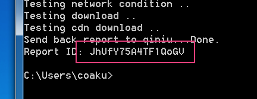
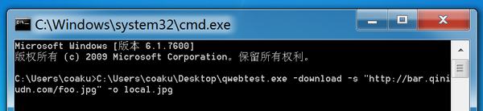

- [简介](#intro)
- [下载](#download)
- [视频教程](#tutorials)
- [使用方法](#usage)
    - [检测下载问题](#usage-download)
    - [检测上传问题](#usage-upload)
    - [查看检测报告](#usage-report)
    - [平台使用差异](#usage-platform-difference)

<a id="intro"></a>

# 简介

qwebtest是七牛云存储提供的一款检测工具，用于应对如下场景：

	遇到了一个奇怪的资源下载（或上传）问题，您第一时间将现象简单反馈给我们的技术支持，但有时候由于各种不可控的原因（比如提供的信息有限，或者问题重现困难等），问题变得难以排查。

通过在实际环境中模拟下载（或上传）行为，qwebtest自动检测、收集与当前网络相关的各种信息，并形成可读的报告。
借由这份报告，我们可以更快更准确地排查出问题所在和根本原因，节省用户在客户端花费的排查时间，同时降低在服务端寻找线索的困难度。

---

<a id="download"></a>

# 下载

- 命令行工具：
    - Windows 32位：[http://devtools.qiniu.io/windows_386/qwebtest.exe](http://devtools.qiniu.io/windows_386/qwebtest.exe)
    - Windows 64位：[http://devtools.qiniu.io/windows_amd64/qwebtest.exe](http://devtools.qiniu.io/windows_amd64/qwebtest.exe)
    - Linux 32位：[http://devtools.qiniu.io/linux_386/qwebtest](http://devtools.qiniu.io/linux_386/qwebtest)
    - Linux 64位：[http://devtools.qiniu.io/linux_amd64/qwebtest](http://devtools.qiniu.io/linux_amd64/qwebtest)
    - Mac OS X：[http://devtools.qiniu.io/darwin_amd64/qwebtest](http://devtools.qiniu.io/darwin_amd64/qwebtest)

---

<a id="tutorials"></a>

# 视频教程

Windows 版视频教程：[http://developer.qiniu.com/tutorial%2Fqwebtest_video_for_win_web_low.mp4](http://developer.qiniu.com/tutorial%2Fqwebtest_video_for_win_web_low.mp4)

---

<a id="usage"></a>

# 使用方法

注意：Windows版本的用法与Linux/Mac版本略有不同，请参考[平台使用差异](#usage-platform-difference)。

<a id="usage-download"></a>

## 检测下载问题

```
qwebtest -download -s <problem_url> [-H headers][-o output][-timeout mins][-src][-from addr]
    -s          指定下载地址URL
    -H          添加请求的自定义Header, 格式: -H "Referer: http://bar.foo.com"
    -o          指定文件输出路径, 若不指定, 下载的文件内容则被丢弃
    -src        穿透CDN, 直接从源站下载
    -from       从指定的源站服务器直接下载
    -timeout    设置程序运行的最长时间（单位：分钟）
```

其中`<problem_url>`为用户下载出问题的URL地址。

常用实例：

方式             | 命令
:--------------- | :-------------------------------------------------------------------------
从CDN下载        | `qwebtest -download -s "http://bar.qiniudn.com/foo.jpg"`
从CDN下载并保存  | `qwebtest -download -s "http://bar.qiniudn.com/foo.jpg" -o local.jpg`
从源站下载       | `qwebtest -download -s "http://bar.qiniudn.com/foo.jpg" -src`
从源站下载并保存 | `qwebtest -download -s "http://bar.qiniudn.com/foo.jpg" -o local.jpg -src`

<a id="usage-upload"></a>

## 检测上传问题

```
qwebtest -upload [-f inputfile][-r][-to addr][-ak access_key][-sk secret_key][-bucket bucket][-timeout mins]
    -f          指定文件上传, 若不指定则默认随机生成内容上传
    -r          使用断点续上传模式, 若不指定则默认使用普通上传
    -ak         指定Access Key
    -sk         指定Secret Key
    -bucket     指定Bucket
    -to         上传到指定的服务器
    -timeout    设置程序运行的最长时间（单位：分钟）
```

常用实例：

方式                   | 命令
:--------------------- | :-------------------------------------------------------------------------
生成随机内容上传       | `qwebtest -upload`
生成随机内容断点续上传 | `qwebtest -upload -r`
指定本地文件上传       | `qwebtest -upload -f /path/to/local.jpg`
指定本地文件断点续上传 | `qwebtest -upload -f /path/to/local.jpg -r`
指定上传到某个空间foo  | `qwebtest -upload -f /path/to/local.jpg -ak x6789..djh68 -sk 78d78a..67fa -bucket foo`

<a id="usage-report"></a>

## 查看检测报告

命令运行结束时，会在当前目录下生成一个名为`qwebtest.result.<ID>.txt`的报告文件，用户可以自行查看，也可以将该ID告诉我们的工作人员，我们会根据这个ID找到对应的报告文件。

报告ID可以从程序运行之后的输出中获得，例如：

```
$ ./qwebtest -download -s "http://xoxo.qiniudn.com/1.jpg"
Get base info ..
Testing network condition ..
Testing download ..
Send back report to qiniu...Done.
Report ID: 4vGY4BTComyongl3
```

其中的`4vGY4BTComyongl3`就是报告ID。

Windows下获取报告ID的方式参见下图：



<a id="usage-platform-difference"></a>

## 平台使用差异

### Windows

按下`Win + R`调出运行对话框，输入命令`cmd`并按回车执行。
在弹出的命令行终端界面中，输入该工具的所在的路径（或者简单地用鼠标将工具拖拽至命令行终端中），然后填入相关检测参数后即可执行。例如：



### Linux & Mac

直接在终端界面中调出命令行工具，输入检测参数后即可执行。
